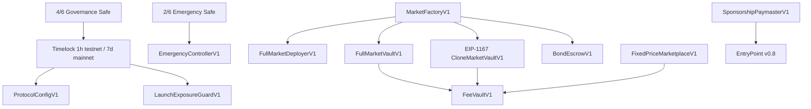

# Cpredict V1 完整合约设计

## 1. 目标和非目标

目标是非升级、USDC 计价、单池多桶的 parimutuel 协议。安全优先级是本金偿付、故障可退、
市场隔离、最小权限、数学守恒、可回溯。V1 不做 AMM、CLOB、买方报价、operator 签名、
仲裁、管理员改结果、链上排序、跨市场本金池或后端托管订单。

## 2. 架构



每个市场是独立 Vault 和独立 ERC-1155 地址，outcome token ID 是 `0..outcomeCount-1`。
这有意偏离产品文档的全局 `盘×桶` tokenId 字面表达，换取本金、权限、receiver 和故障域隔离。

Full 与 Clone 使用相同 core/storage/ABI。Full 由只允许 Factory 调用的 deployer 通过 CREATE2
创建，Factory 在同一交易立即初始化；Clone 是固定 implementation 的 EIP-1167 实例并原子初始化。
外部调用无法插入部署与初始化之间。Full 是旗舰推荐，Clone 带显著风险标识且 cap ≤500 USDC。

Factory 部署后默认不可创建市场。Governance 必须在 marketplace、Guard、Bond/Fee、Full deployer
等一次性接线完成后调用 `activate(expectedFingerprint)`；该操作先检查每个必需/已配置依赖存在 runtime code、
关键治理/Factory/token/Permit2 接线一致，再将 chainId、Factory、依赖地址及当前 codehash 组成的
`dependencyFingerprint` 与经独立部署清单提供的期望值比较。激活不可逆且不能用第二次调用替换指纹；
激活前 `createMarket` 以 `FactoryNotActive` 失败关闭。

## 3. 状态机

| 状态                               | 允许                                                    | 禁止                 |
| ---------------------------------- | ------------------------------------------------------- | -------------------- |
| OPEN，`now < closeAt`              | buy、transfer、listing/fill/cancel、creator void        | resolve、timeout     |
| CLOSED，`closeAt ≤ now < deadline` | transfer、listing/fill/cancel、creator resolve/void     | primary buy、timeout |
| RESOLVED                           | winner/early claim、loser burn、terminal listing return | 新风险、状态改变     |
| VOIDED_CREATOR                     | 1:1 refund、bond return、terminal listing return        | 新风险、结果改变     |
| VOIDED_TIMEOUT                     | 1:1 refund、延迟 bonus、terminal listing return         | 新风险、结果改变     |

市场存储不需要 keeper 写入 CLOSED；所有入口按时间计算。终局不可逆。resolution deadline 是
`closeAt + 24 hours`。creator 的 resolve/void 窗口均为半开区间：仅 `now < deadline`；在
`now == deadline` 时 creator 入口已关闭且 `voidAfterDeadline` 对任何地址开放，二者没有同一时间戳
竞争窗口。胜桶 supply 为零时禁止 resolve，creator 必须在窗口内 void，超时后任何人 void。
claim/refund 永不过期。

## 4. 创建与不可变快照

Factory 校验：规则哈希非零；URI ≤512 bytes；2–32 outcomes；封盘距离 5 分钟–90 天；
`createdAt ≤ earlyBirdStart < closeAt`；Full/Clone cap 受配置上限和硬上限；最低操作单位在
10,000–5,000,000 atomic units；bond 为 `max(10 USDC, ceil(cap×2%))` 至 1,000 USDC；
feature flag 必须是已知位。

第一笔购买前 creator 只能更新 metadata/rules/source/close/early start/treasury 等明确字段；
第一笔购买使经济、时间和展示关键字段冻结。creator、market cap、deployment mode、bond、
payment token 和 Factory 永不改变。配置治理只影响以后创建的市场，不追溯修改存量市场。

## 5. 单位、额度和购买

- USDC 与 share units 都使用 6 位小数；1 整份 = 1,000,000 units = 一级 1 USDC。
- `buy` 使用 desired/minimum/maximumPayment/deadline，遇 cap 时可 O(1) 部分成交。
- per-user cap 按累计一级购买，不因转让/出售恢复；C2C 获取不计入该 cap。
- transfer-in/out 使用 ERC-1155 标准事件；一级 principal 只随 mint 增长，C2C 不改池子。
- 所有协议入账路径（Factory 创建费/bond、一级 buy/Permit2、Marketplace/FeeVault accrual）使用
  recipient 前后余额差、偿付覆盖或两者组合拒绝非精确入账。对外 claim/refund/fee/bond 支付使用
  `SafeERC20`，但不逐笔证明 recipient delta；安全性依赖 canonical USDC 无 fee-on-transfer/rebase
  语义。USDC pause、blocklist、proxy upgrade 仍是外部信任，可能阻断特定地址退出但不会被事件伪装为成功。

## 6. 早鸟

`earlyBirdStart..closeAt` 等分三段，权重 3/2/1；start 前同为 3。每次一级购买累积
`score[user] += units×weight`，不随 ERC-1155 转移。void 无早鸟奖励；resolve 时早鸟池从
creator 净 rake 扣除，不能改变 winner pool。

## 7. 结算会计

设本金 P、creator rake bps 为 r、协议分成 q、早鸟分成为 e：

```text
R = floor(P*r/10000)
Q = floor(R*q/10000)
E = earlyEnabled ? floor((R-Q)*e/10000) : 0
C = R-Q-E
W = P-R
```

所有乘除使用 `Math.mulDiv`，窄化使用 `SafeCast`。winner、early、timeout bonus 都使用动态
remaining-units/remaining-pool：每次按当时剩余池/剩余 units 向下取整，消耗全部剩余 units 的
领取再清空池。该动态比率可使多个领取者而非只有最后一人获得由先前舍入留下的原子单位；领取顺序和
地址拆分会改变原子单位分配，但全体总和精确等于池且不能创造价值。winner/refund 会烧毁 owner 当前相关余额；
`claimFor(owner)` 只能把钱付给 owner，caller 不能指定接收者。

## 8. Timeout bond 解耦

timeout void 只改变市场状态，本金退款立刻可用且不调用 BondEscrow。退款时 burned units
固化为该退款地址的 bonus units。任何人随后执行 `settleBond(market)`，Escrow 校验 Factory
注册与 timeout 状态，把 bond 注入 Vault。bonus 可稍后独立领取。Escrow 故障不会卡本金。
如果市场从未产生任何一级本金，timeout 时不存在可分配 eligibility；`settleBond` 将 bond 记为
creator 的 pull credit，并同时发出 `EmptyTimeoutBondCredited` 与 `BondCredited`，避免把资金注入
一个永远无人可 claim 的 bonus pool。

## 9. C2C

Marketplace 只接受 Factory 注册市场；仅在 createListing 的预期 callback 中接收单笔
ERC-1155，拒绝直接转入和 batch。listing ID = chain/marketplace/vault/seller/sellerNonce 的哈希。
份额托管，买家执行时取 `min(desired, remaining)`，受 minUnits/maxGross/deadline/expiry/dust
保护。seller proceeds 原子直付；平台/creator fee 原子进固定 FeeVault 后记 pull credit。
Marketplace 不保留 USDC 余额。终局关闭 fill，cancel 和 permissionless terminal return 永不暂停。

```text
gross = floor(units*unitPrice/1e6)
platform = floor(gross*platformBps/10000)
creator = floor(gross*creatorBps/10000)
seller = gross-platform-creator
```

## 10. Permit2 与 AA

标准 ERC-20 allowance 始终可用。Permit2 仅使用 SignatureTransfer+witness。Vault 与 Marketplace
分别公开 canonical `BUY_WITNESS_TYPE_STRING` / `FILL_WITNESS_TYPE_STRING`，严格使用 Permit2 要求的
`<PrimaryType> witness)<PrimaryType>(...)TokenPermissions(address token,uint256 amount)` 后缀；业务
witness 绑定 owner/buyer、Vault/Marketplace、selector、market/listing、outcome、desired/min/max、
call deadline 和 chainId，Permit2 自身再绑定 token/amount、nonce/deadline/spender。实现不转发任意 calldata，
SDK 与 Solidity 用独立 EIP-712 reference vector 防止“双方同错”。

Paymaster 签名绑定 sender/nonce/initCodeHash/callDataHash、accountGasLimits、preVerificationGas、
gasFees、`paymasterVerificationGasLimit`、`paymasterPostOpGasLimit`、validity/maxCost/policy/
chain/EntryPoint/Paymaster；后两个 gas header 分别限制为 150k–500k 与 100k–300k，修改任一字段都会
改变 digest。合约按 operation、user/day、global/day 预留并按已消费+活跃预留
封顶；`postOp` 释放 reservation 后把完整 reserved prefund 计入 spent，而不是低估为不含 postOp/
unused-gas penalty 的 `actualGasCost`，形成保守损失上限。它不接触 USDC 本金。生产服务必须使用 KMS/HSM、
短期鉴权、已知 account decoder、target/selector 白名单和有限 EntryPoint deposit。
仓库服务仅证明 schema/policy/digest、鉴权接口、持久预算提交语义和 KMS/HSM adapter 边界可运行；
没有内置 raw-key signer，也不证明真实 KMS、Bundler、TLS/WAF、链上 signer 对账或生产可用性。

## 11. 权限与暂停

| 主体                | 能做                                                                           | 明确不能做                        |
| ------------------- | ------------------------------------------------------------------------------ | --------------------------------- |
| Governance Timelock | 有界配置、未来 market limits、授权 accrual、guard cap/retire、Paymaster policy | 改存量市场、改结果、取本金        |
| Emergency Safe      | 每 epoch 一次、≤7 天暂停新增 market/buy/listing/fill/Permit2/Paymaster         | unpause、续期、提款、调高费用     |
| Creator             | 创建、首注前有限更新、deadline 前 void、close 后窗口内 resolve                 | 提本金、改公式、超时 resolve/void |
| 任意地址            | timeout、bond settle、guard sync、terminal return、claimFor                    | 把他人权益付给自己                |

应急到期自动恢复；Timelock 必须开启新 epoch 后 Emergency Safe 才能再次暂停。撤单、transfer、
winner claim、early claim、refund、timeout bonus 永不受暂停影响。

## 12. 失败与恢复

USDC pause/blocklist 会令受影响地址转账失败，但不能导致会计静默变化；恢复依赖 USDC 发行方。
Arbitrum sequencer/RPC 故障不改变终局，客户端必须停止无界重试并等待 canonical receipt。索引器不是
会计真相；它保存每个扫描区块（含无事件区块）的 hash/parentHash，发现不一致后向后找到 common
ancestor，在单一存储事务中删除分叉后的 raw/derived rows 并重放。Factory `MarketCreated` 动态发现
Vault，同批扫描初始化事件；只读 API 和 terminal worker 均不得代替交易前 RPC simulate。若发现漏洞，
Emergency Safe 仅停止新增敞口；存量退出保持。
不可升级设计的修复方式是部署新版本、Factory deprecate、前端迁移；旧市场按原代码存续至清算。
